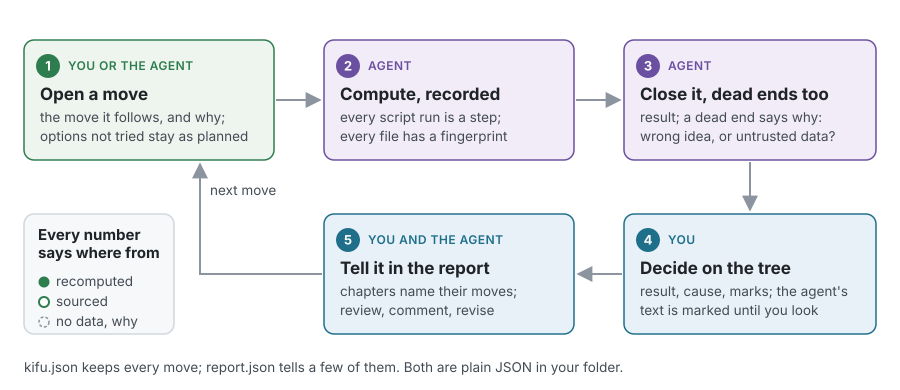
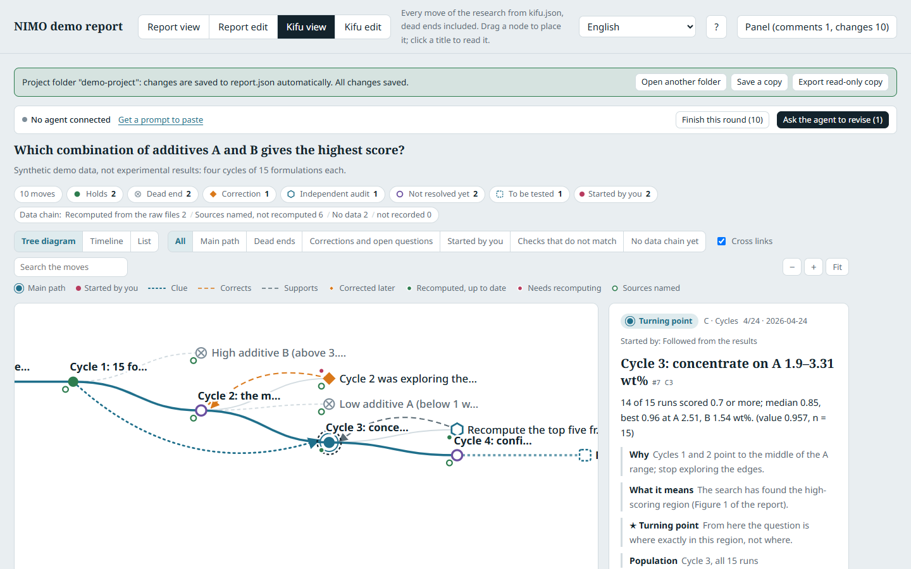
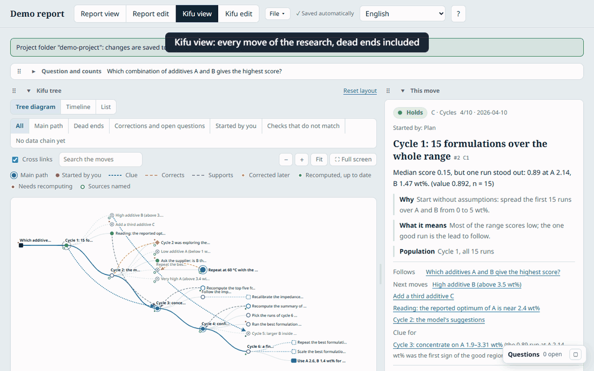
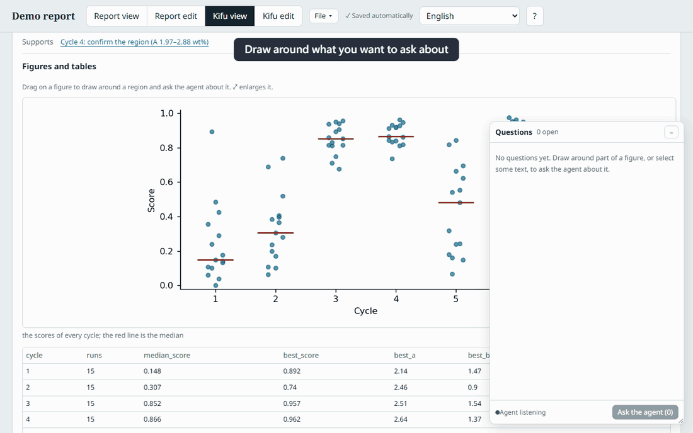
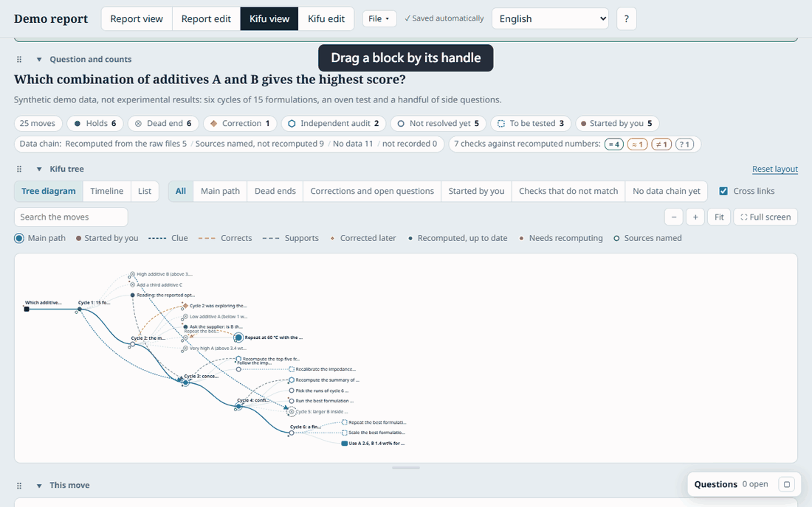
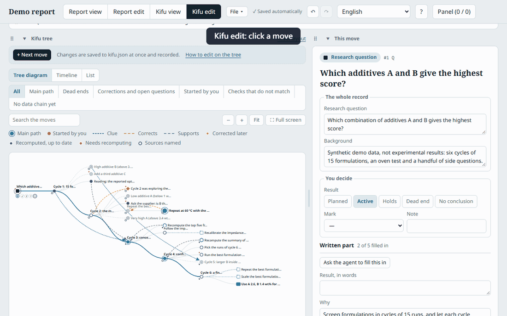
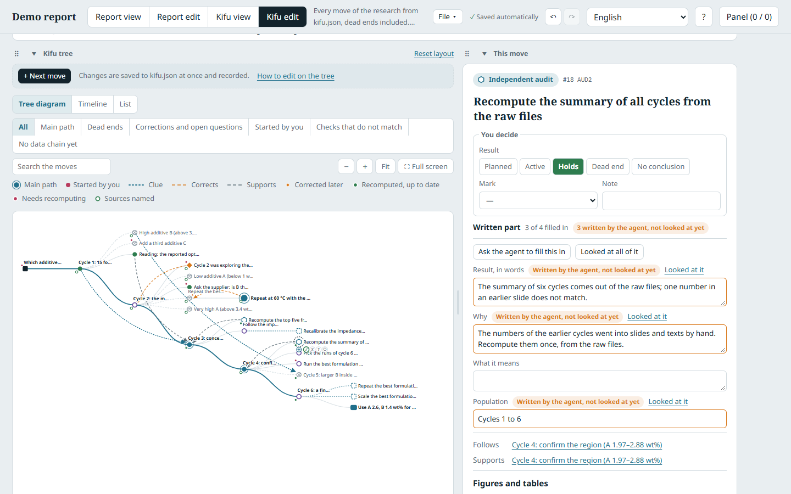
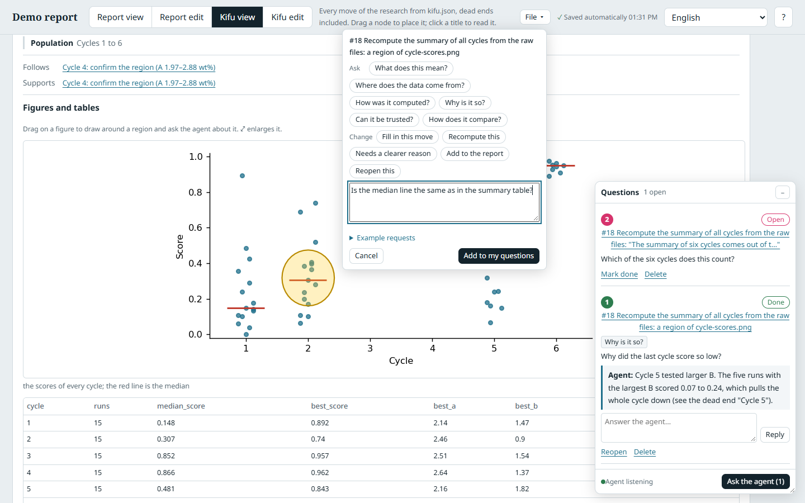
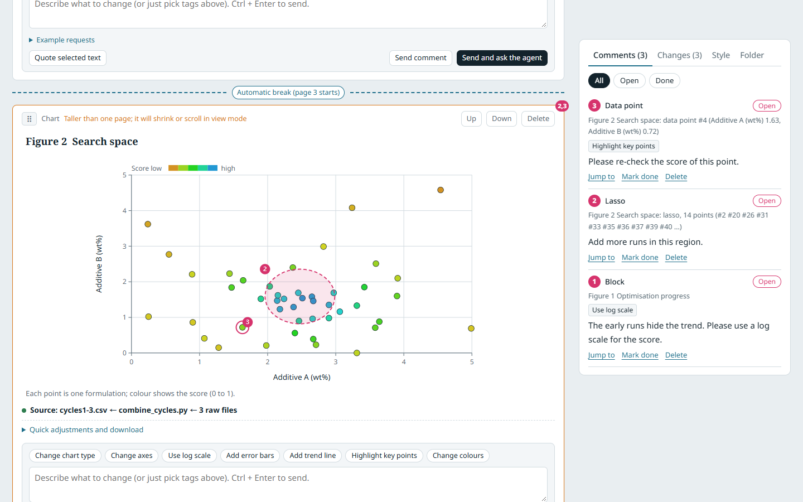

# Duetkifu

**The research record you and your AI agent keep together: every move, dead ends included, and where each number comes from.**

A paper shows the line that worked. The rest of the research, the attempts that failed, the numbers that were later corrected, the clue that was noticed too late, stays in chat logs, slides and memory, and is lost. With AI agents trying a dozen things a day, that part grows faster than anyone can write it down.

Duetkifu keeps it. Every attempt is a **move** with the move it follows, why it was made, what came of it and, for a dead end, why it ended. Every number says where it comes from: recomputed from the raw files by recorded scripts, taken from a named file whose fingerprint is checked, or no data, with the reason. The record is drawn as a tree that you read and edit in the browser; your agent writes the text, you decide.

Why the name: a **kifu** is the record of a game of shogi or go, move by move. Players replay it afterwards to see where the game turned and which moves were mistakes. In a **duet**, two play from the same sheet: here, a researcher and an AI agent.

> **Status: v0.8 prototype.** Duetkifu grew out of [Duetsheet](https://github.com/Ashur5457/duetsheet), the interactive report you and an agent revise together, and includes it: the report and its review loop work as in Duetsheet. See the [tutorial](docs/tutorial.md) and the [roadmap](#roadmap).







## In action

| Ask while you read | Arrange the page |
|---|---|
|  |  |

Editing a move and taking a change back: 

## Why

- **Dead ends are results.** A failed move needs a reason and a cause, and the cause says what kind of dead end it is: the idea was wrong, the data cannot be trusted (so the path was never really tested), the analysis method, the cost. The next person, or the next agent, can tell a closed path from an untested one.
- **Every claim can be checked.** A move points at the steps that recompute its numbers, or at the files they come from, with SHA-256 fingerprints. A recomputation is recorded next to the stated number as a check: match, close, no, or not reproducible. Mismatches are listed for you; nothing is rewritten to make them agree.
- **Agents work fast; you stay in charge.** Your agent opens and closes moves as it works, and writes their text from the sources. The page marks what the agent wrote and you have not looked at yet. The result of a move, the confirmed cause and the review marks are yours.
- **Corrections and missed clues stay visible.** A correction points at the move it corrects; an early clue points at the move that later proved it. Replaying the record shows where the research really turned.

## Features

**The research record (`kifu.json`)**
- **A tree you can read**: from the research question on the left, each move after the move it follows. The shape of a move says how it ended (holds, dead end, correction, independent audit, not resolved yet, planned); arrows show clues, corrections and support. Also as a timeline and a list.
- **The main path and the rest**: the moves that the report tells form the main path; highlight only the dead ends, the corrections and open questions, the moves you started, the checks that do not match, or the moves with no data chain yet. Search by any word.
- **Each move in full**: why, result, what it means, the population the numbers refer to, the steps and files behind it with their state, the figures and tables it points at (shown in place), the checks against recomputed numbers, and comments.
- **Edit on the tree**: select a move and set its result with the buttons beside it (a dead end asks for its cause and one sentence why); drag a move to place it, or onto another move to follow it; drag its **+** onto another move to draw an arrow, or onto empty space to add the next move. The form beside the tree has three parts: what only you decide, the text the agent can fill in, and the rest under Advanced.
- **Every edit recorded**: each change to a move is kept with who made it and when, whether made in the page or by the agent.
- **Comment on a move**: under any move, write a comment with tags such as **Fill in this move** or **Recompute this**, and **Send and ask the agent**.
- **Arrange the page**: the blocks (question, tree, the move, main path) are dragged by a handle above or beside each other, folded to one row, resized, or shown full screen; the arrangement is kept in your browser.
- **Ask while you read**: in the read-only views, draw around a region of a figure or select some text to ask the agent about it. The questions wait in a floating panel, one button sends them, and the answers come back there to reply to. Question tags (*Where does the data come from?*, *How was it computed?*, *Can it be trusted?*) get an answer, not an edit.
- **Saved as you go**: every change is written at once; Undo and Redo take back your own changes; a File menu takes snapshots, exports, and clears comments (after a snapshot).

**For agents in large folders**
- `find FOLDER "words"`: full-text search of every file in the folder (HTML reports by section, Word by heading, slides by slide, spreadsheets by sheet and header, the report by block, the record by move), in any language, from a local SQLite index kept outside the folder. Agents read a few excerpts instead of megabytes.
- `kifu show FOLDER MOVE`: one move with its data chain and the parts of its sources that concern it.
- `extract FOLDER report.html`: the figures and tables of an HTML report or a slide deck, written out with their section and caption, so moves can point at them.

**The report (from Duetsheet)**
- Paginated view; edit text, charts, tables and images in place; comment on any block; draw around data points free-hand or click one point, stored as data ranges and row ids, not pixels.
- **Ask the agent to revise**: one button hands your comments to the agent waiting in the background; it answers under each comment.
- Change log with inline diffs, rounds and a timeline; human and agent edits kept apart.
- The data chain: every chart traced through the scripts that made it back to its raw files, with fingerprints; everything computed from a changed file turns red.
- Your figure style and writing habits, learned from your own files.
- Six interface languages (English, Traditional and Simplified Chinese, Japanese, Korean, Spanish), plus your own.







## Quick start

### With Claude Code (recommended)

You need Python 3.8 or later (nothing else to install).

1. In Claude Code in a terminal, VS Code or JetBrains, install once:
   ```
   /plugin marketplace add Ashur5457/duetkifu
   /plugin install duetkifu@duetkifu
   ```
   In the **Claude desktop app** (which cannot add plugin marketplaces), run this in a terminal instead:
   ```bash
   git clone https://github.com/Ashur5457/duetkifu.git && python duetkifu/duetkifu.py install-skill
   ```
2. Open Claude Code in the folder that holds your raw data and type `/duetkifu`, or say:
   > Start Duetkifu. Write a report from the data in this folder, and keep a research record of what we try.

   Claude reads [`AGENTS.md`](AGENTS.md), proposes a report and a first record, writes them after you agree, checks them, and opens the page in your browser, already connected to the folder. Duetkifu keeps its files in a `duetkifu/` subfolder; your raw data is only read.
3. Read the record in **Kifu view** and the report in **Report view**. Correct things in **Kifu edit** and **Report edit**, and write comments.
4. Click **Ask the agent to revise**. Claude, waiting in the background, handles your comments and updates the report and the record; the page reloads by itself.

To try it without your own data, open the demo: `python duetkifu.py examples/demo-project` (synthetic data).

### With any other agent, or none

```bash
python path/to/duetkifu.py "path/to/your/data-folder"
```

It opens the page in your browser. Your agent (Codex, Copilot, Gemini CLI, Cursor, a script) edits `duetkifu/report.json` and `duetkifu/kifu.json`, following [`AGENTS.md`](AGENTS.md), and runs `python duetkifu.py check <folder>`. `python duetkifu.py init-agent <folder>` adds a marked section to `AGENTS.md` and `CLAUDE.md` in the folder, so agents find the rules by themselves. Without Python, open [`duetkifu.html`](duetkifu.html) in Chrome or Edge and choose the folder.

A folder you already review with Duetsheet opens as it is: Duetkifu reads its `duetsheet/` subfolder and the same `report.json`.

## Use it with any AI agent

Duetkifu does not call any AI model. Your agent reads and writes plain JSON:

- [`AGENTS.md`](AGENTS.md): both formats, how to write them safely, and the tasks (keep the record as you work, handle comments on a move or a block, find things in a large folder, revise the report, import data).
- [`duetkifu.py`](duetkifu.py): the launcher and checker (`check`, `kifu check|tree|show`), the data chain (`step`), search (`index`, `find`), `extract`, and the helpers for the review loop (`annotations`, `wait`, `agent-status`).
- [`skills/duetkifu/SKILL.md`](skills/duetkifu/SKILL.md): the `/duetkifu` skill for Claude Code.
- [`schema/kifu.schema.json`](schema/kifu.schema.json) and [`schema/report.schema.json`](schema/report.schema.json): the JSON Schemas.
- [`examples/demo-project/`](examples/demo-project/): a complete project folder with a record of 25 moves.
- [`llms.txt`](llms.txt): a short index for LLMs.

Prompts that work well:

> Using AGENTS.md, keep a research record in kifu.json as we work: open a move before each thing you try, and close it with the result and, for a dead end, the reason and a suggested cause.

> Rebuild the research record of this project from its reports and slides. Use find and kifu show instead of reading whole files; name the file behind every number.

> Read the open comments. For a comment on a move, follow "Handle comments on a move" in AGENTS.md.

## How it works

Two files next to each other, in the `duetkifu/` subfolder of your data folder:

| File | What it holds |
|---|---|
| `kifu.json` | The research record: `moves` (each with parent, kind, status, outcome, cause, reason, why, result, population, links, evidence), the research question, and `changes`, one record per edited field with who and when. |
| `report.json` | The report, in the Duetsheet format: blocks, datasets with their source files, annotations, changes, rounds, style, and `steps`, the data chain. A chapter can name the move it tells. |

`evidence` connects the two: a move lists the steps of the report's data chain that recompute it, or the files its numbers come from, each with a SHA-256 fingerprint. `python duetkifu.py check` compares every file with its fingerprint and reports each move whose files changed, each check that does not match, and each move with no data chain.

The page is one HTML file with no build step. A small launcher (Python standard library only) serves it on your own computer (127.0.0.1, with a random token) and lets it write only its own files.

## Who it is for

- Researchers who work with AI agents on data analysis and want the whole path kept, not only the result: materials and chemistry, biology, physics, machine learning experiments.
- Labs and self-driving labs, where a record of every tried condition, and why it failed, is the data the next round learns from.
- Anyone who has to hand a project over and explain what was tried, what failed and why.
- Anyone who reviews an AI-drafted, data-heavy report claim by claim (that part is Duetsheet).

## FAQ

**What is a move?**
One attempt: a computation, an experiment, a new analysis, a correction of an earlier result, an independent re-check, or an option thought of but not tried (a planned move). Each move follows one earlier move, whose result or idea it builds on.

**Why record failures?**
Because the next attempt depends on why the last one failed. "The idea was wrong" closes a path; "the data could not be trusted" leaves it untested. Without the record, both look like "did not work".

**Does the agent decide what happened?**
No. The agent writes the text and suggests a cause (marked unconfirmed). The result of a move, the confirmed cause and the review marks are yours; the page marks what the agent wrote until you look at it.

**How is this different from an electronic lab notebook or git?**
A notebook is a diary in time order; git records file versions. Duetkifu records the reasoning: which move followed which, why, what came of it, and whether each number can be recomputed. It is written by the agent as it works and checked by you, and it is plain JSON that any tool can read.

**Where is my data?**
In your folder. Duetkifu has no online service; the launcher only listens on your own computer. Your agent reads the files it needs, and what it sends to its model depends on the agent you use. The search index is kept outside the folder (in `~/.duetkifu/index/`) and can be deleted at any time. The page loads fonts from Google Fonts and one small library from a CDN.

**Do I need Claude?**
No. Any agent that can read and write files works with it, following `AGENTS.md`; Claude Code has a skill that starts it.

**Is it free?**
Yes, MIT licensed.

## Limitations

- A prototype: the record format (`duetkifu/0.1`) may still change; old files will keep opening.
- Recomputation is as good as the recorded scripts: a move whose data or definition is lost is marked not reproducible, not reconstructed.
- Experiments cannot be replayed like code: a move's parent means "based on what that move found", not a saved state to go back to.
- Figures drawn by a report's own scripts (canvas, tables filled in by JavaScript) are not extracted; embedded images and HTML tables are.
- Opening a folder from the page itself needs Chrome or Edge; with the launcher any modern browser works. Designed for desktop browsers.
- The report part has the limitations of Duetsheet: see its [README](https://github.com/Ashur5457/duetsheet#limitations).

## Roadmap

- Commands for agents to open and close moves (`kifu move add`, `kifu move close`), so no one edits JSON by hand
- A move pointing at blocks of the report (`evidence.blocks`), shown in place
- Replay: step through the record in time order, adding review marks, as in reviewing a game
- Recompute from the page: run the steps of a move that need recomputing
- Comparing strategies: replay a record to see what another choice of next move would have found (only for moves already made)
- Self-driving labs: physical experiment steps as moves, behind explicit human approval
- Records and review marks as evaluation sets for research agents

## Contributing

Issues and pull requests are welcome, especially records from other fields and translations.

- `duetkifu.html` is the only source file of the page. There is no build step: edit it and open it in a browser.
- New interface text goes through `tr('English text')` and needs an entry in the translation tables ([docs/translating.md](docs/translating.md)).
- Before sending a pull request, run `python tools/check.py` (English code, valid translations, JavaScript syntax with Node.js) and the tests: `python tests/test_kifu.py`, `python tests/test_chain.py`, `python tests/test_agent.py`. They use temporary folders and the demo project, never your data.

## Citation

If you use Duetkifu in research, please cite it using [`CITATION.cff`](CITATION.cff) (GitHub shows a "Cite this repository" button).

## License

[MIT](LICENSE)

---

*Keywords: Duetkifu, research record, kifu, lab notebook, negative results, dead ends, provenance, data lineage, reproducible research, recomputation, SHA-256, AI agents, human-in-the-loop, research agents, self-driving labs, scientific workflow, Claude Code, AGENTS.md, JSON Schema, Duetsheet.*
