# Duetkifu tutorial

Duetkifu keeps a research project as two files that you and an AI agent write together: the **record** of every move of the research (`kifu.json`), dead ends included, and the **report** that tells the finished story (`report.json`).


This tutorial uses the demo project in [`examples/demo-project`](../examples/demo-project): a search for the best mix of two additives over six cycles, with synthetic data (not experimental results) and a record of 25 moves: the cycles, ideas that were wrong, an oven that failed, a measurement that could not be trusted, two corrections, two independent re-checks and the next steps.

1. [Install](#1-install) (once)
2. [Start](#2-start)
3. [Read the record, and arrange the page](#3-read-the-record-and-arrange-the-page)
4. [Ask while you read](#4-ask-while-you-read)
5. [Edit the record on the tree](#5-edit-the-record-on-the-tree)
6. [Let the agent write, and check what it wrote](#6-let-the-agent-write-and-check-what-it-wrote)
7. [Where each number comes from](#7-where-each-number-comes-from)
8. [Large folders: search instead of reading](#8-large-folders-search-instead-of-reading)
9. [The report: review it with the agent](#9-the-report-review-it-with-the-agent)
10. [Saving, undo and backups](#10-saving-undo-and-backups)

Then: [raw data, habits and languages](#11-raw-data-habits-and-languages) and [what to do when something goes wrong](#when-something-goes-wrong).

You need a desktop computer with Chrome or Edge, and Python 3.8 or later (no packages to install).

## 1. Install

### With Claude Code in a terminal, VS Code or JetBrains

```
/plugin marketplace add Ashur5457/duetkifu
/plugin install duetkifu@duetkifu
```

Start a new session and type `/`: **duetkifu** is in the list. Update with `/plugin marketplace update duetkifu`; remove with `/plugin uninstall duetkifu@duetkifu`.

### With the Claude desktop app, or without the plugin system

In a terminal, in the folder where you want to keep Duetkifu (you need [git](https://git-scm.com/)):

```bash
git clone https://github.com/Ashur5457/duetkifu.git && python duetkifu/duetkifu.py install-skill
```

This installs the `/duetkifu` skill into `~/.claude/skills/`, where the desktop app, the terminal and the editor extensions all find it. To update: `git pull` in the `duetkifu` folder, then `python duetkifu.py install-skill` again. No git? [Download the ZIP](https://github.com/Ashur5457/duetkifu/archive/refs/heads/main.zip) and run `python duetkifu.py install-skill` in the unzipped folder.

### With other AI agents (Copilot, Cursor, Codex, Gemini CLI and others)

Once per data folder:

```bash
python path/to/duetkifu.py init-agent "path/to/data-folder"
```

It adds a short marked section to `AGENTS.md` and `CLAUDE.md` in the folder that tells any agent where the rules are. Everything else in those files is kept. Duetkifu never calls an AI model itself.

## 2. Start

**From Claude Code.** Open Claude Code in the folder that holds your raw data and type `/duetkifu`. Tell Claude what you want: a report from the data, a record of the research so far (from your reports and slides), or both. Claude proposes them, writes them after you agree, checks them and opens the page, already connected to the folder.

**Without an agent.** `python path/to/duetkifu.py "path/to/data-folder"`, or open [`duetkifu.html`](../duetkifu.html) in Chrome or Edge and click **Open project folder**. To follow this tutorial, open `examples/demo-project` (work on a copy: the page saves into it).

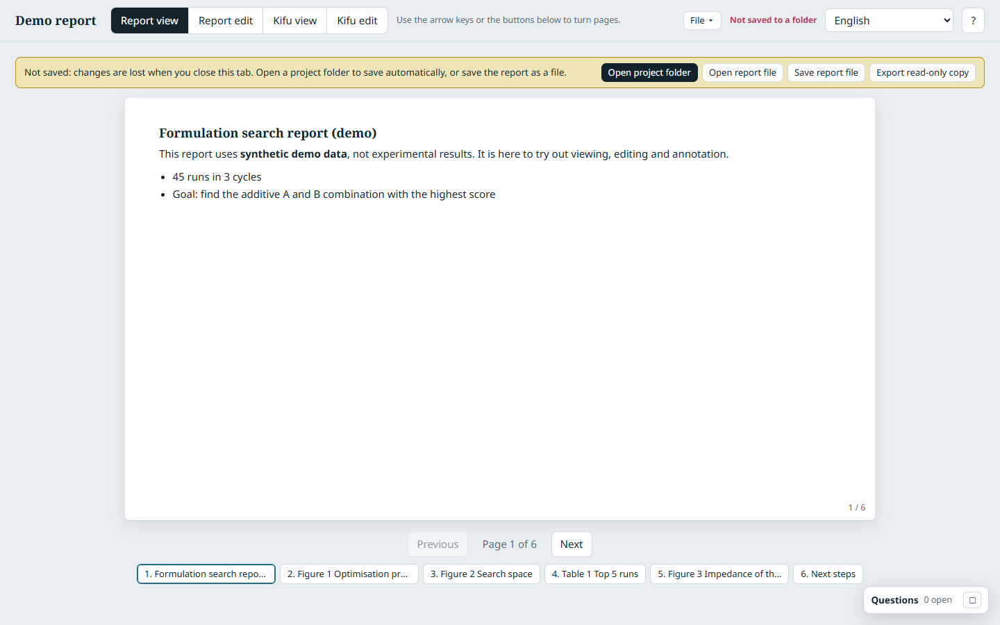

**Where files go.** Duetkifu keeps everything it writes in a `duetkifu/` subfolder of your data folder. Raw data stays *inside* the folder you open but *outside* `duetkifu/`, and is only read. What is computed from it goes *inside* `duetkifu/`.

```
my-experiment/                the folder you open
  Data_R1/run001.xlsx         raw data: stays where it is, only read
  duetkifu/                   made by Duetkifu
    kifu.json                 the research record
    report.json               the report
    derived_data/cells.csv    tables computed from the raw data
    scripts/make_cells.py     the scripts that compute them
```

A folder you already review with Duetsheet has a `duetsheet/` subfolder instead: Duetkifu opens it as it is. (The demo uses a simpler layout, with both files at the top and the raw data in `data/`.)

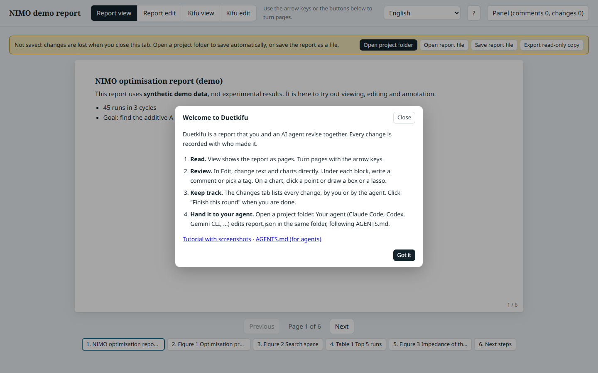

**The top bar.** The four buttons switch between **Report view**, **Report edit**, **Kifu view** and **Kifu edit**. To their right: the **File** menu (snapshot, export, clear comments), the line that says the page [saves by itself](#10-saving-undo-and-backups), and, while you edit, the **Undo** and **Redo** arrows. The **?** button explains the mode you are in and lists the names of the parts of the page ("Kifu tree", "This move", "Questions panel", and so on), so you and your agent can talk about them.

## 3. Read the record, and arrange the page

Click **Kifu view**. The research question is on the left; each move follows the move it was based on.


- **The shape says how a move ended**: a filled dot holds, a crossed circle is a dead end, an orange diamond corrects an earlier move, a hexagon is an independent audit, an open circle is not resolved yet, a dashed square is planned. The legend above the tree lists them all.
- **Arrows**: a dotted arrow is a clue (the good run of cycle 1 pointed at the region cycle 3 found), a dashed orange arrow a correction, a grey dashed arrow support.
- **The small dot at the lower left of a move** is its data chain: filled green when its numbers are recomputed from the raw files and nothing changed, red when something changed, a ring when its sources are named.
- **Click a move** to read it in **This move**: why it was made, the result, what it means, the population its numbers refer to, where it sits in the record, its source, its figures and tables, its data chain, and the checks against recomputed numbers.
- **Highlight** shows only the main path (the moves the report tells), the dead ends, the corrections and open questions, the moves you started, the checks that do not match, or the moves with no data chain yet. **Timeline** puts the moves on their dates; **List** shows them as cards.

Dead ends in the demo are worth reading, because they are not all the same:

- *High additive B* and *Cycle 5* failed because **the idea was wrong**: the runs were made and scored low.
- *Repeat at 60 °C* failed because **the oven did not reach 60 °C**; the correction *Repeat at 60 °C with the calibrated oven* (orange arrow) did the test properly, and the first move now shows the orange dot "corrected later".
- *Follow the impedance drift* has no result you can use, because the cell was not calibrated: the **data cannot be trusted**, so the idea was never really tested. That is a different dead end from a wrong idea, and the cause says so.
- *Add a third additive C* was dropped for its **cost**, without a single run.
- The independent re-check *Recompute the summary of all cycles* lists one number from an earlier slide that does **not** match the raw files. It is listed, not rewritten.

### Arrange the page

The Kifu view is made of blocks with names: **Question and counts**, **Kifu tree**, **This move** and **Main path**. Arrange them the way you work; the arrangement is kept in your browser.

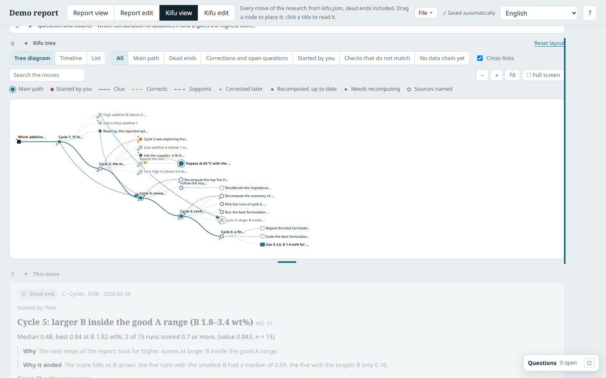

- **Move a block**: drag its handle (⠿, left of the title). A blue line shows where it will go: on the top or bottom half of another block it gets a row of its own there; on its left or right edge it sits beside that block (two blocks at most in a row, with a grip between them to set the widths).
- **Fold a block to one row**: click ▾ next to its title. A folded *This move* shows the title of the selected move.
- **Resize**: drag the grip under the tree or under *This move* to change its height; double-click a grip to go back to the default.
- **Reset layout** (above the tree) brings everything back.
- **Full screen**: **⛶ Full screen** in the toolbar of the tree fills the window with the tree and floats *This move* on its right, where you can fold it. Esc leaves.

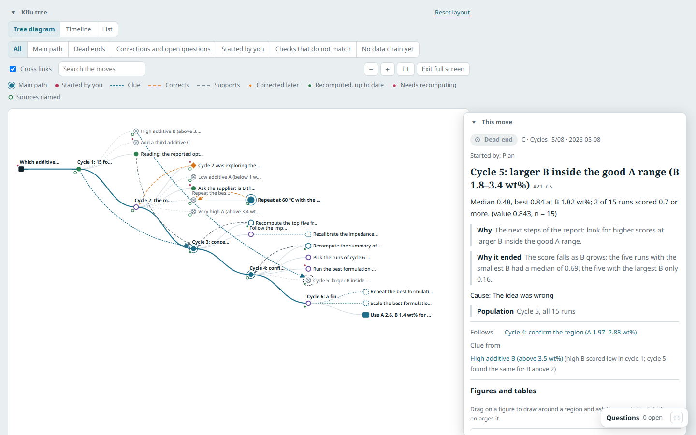

## 4. Ask while you read

You do not have to switch to an edit mode to ask the agent about something you read. In **Report view** and **Kifu view**:

- **Draw around a region of a figure.** Hold the mouse button on a figure and draw around what you mean, as in a paint program. On a chart you can also click a single point. In *This move*, the figures of a move can be drawn on the same way; **⤢** in the corner of a figure enlarges it (a single click does nothing).
- **Select some text.** An **Ask the agent** button appears next to the selection.

A small window opens. Pick one of the **Ask** tags (*What does this mean?*, *Where does the data come from?*, *How was it computed?*, *Why is it so?*, *Can it be trusted?*, *How does it compare?*) or type your own question, and click **Add to my questions**.


Your questions wait in the **Questions panel**, which floats over the page. Drag its header to move it, drag its corner to resize it, and click **–** to fold it to one line; it remembers where you left it. It lists each question with what it points at (click it to jump there), and the agent's answer under it; **Reply** goes on with the conversation. **Ask the agent (n)** sends all open questions at once, and the answers come back into the same panel. A question can also be marked done, reopened or deleted.

The agent answers a question tag in words: where the number comes from and through which steps, how it was computed, how far it can be trusted. It changes the report or the record only if you also asked for a change.

## 5. Edit the record on the tree

Click **Kifu edit**. The first time, a short card explains the tree; **How to edit on the tree** brings it back.


On the tree:

- **Set the result**: select a move; the small buttons beside it set ✓ holds, ✗ dead end, ? no conclusion, ○ active. A dead end or no conclusion asks for its cause and one sentence why.
- **Move it**: drag a move to place it. Drop it onto another move to make it follow that move.
- **Arrows and new moves**: drag the **+** under the selected move onto another move to draw an arrow (clue, corrects, supports), or onto empty space to add the next move there. Click an arrow to change or delete it.
- **+ Next move** above the tree adds a move after the selected one.

*This move* has the same order and names as in Kifu view, and each part can be edited where it is:

1. **The title**, at the top: click it and type.
2. **You decide**: the result, the cause of a dead end (and whether it is confirmed), and a review mark such as *good move* or *doubtful*.
3. **Written part**: *Result, in words*, *Why*, *What it means*, *Population*. This is the part the agent can write for you (section 6).
4. **Where it sits in the record** and **the source report**.
5. **Figures and tables** the move points at, with their caption: edit a caption, drag ⠿ to reorder, **Remove**, or **Add figure or table** from the folder. The numbers in a table come from its file, so they are not edited here: change the source, or ask the agent to recompute the move.
6. **Advanced** (closed): kind, dates, the branch it belongs to, a milestone, the list of arrows, the data chain.

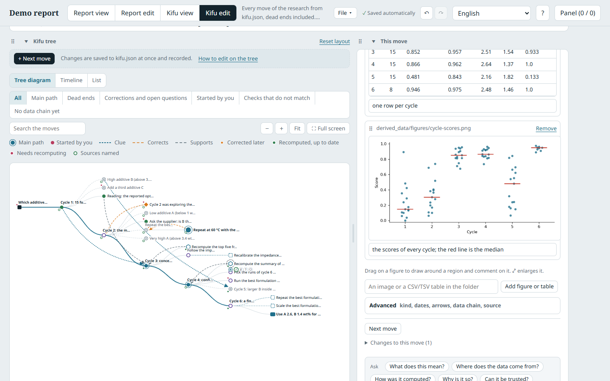

Every change is saved to `kifu.json` at once, and listed under the move with who made it. You can take your own changes back with **Undo** ([section 10](#10-saving-undo-and-backups)).

## 6. Let the agent write, and check what it wrote

Writing down why each move was made and what came of it is the part nobody has time for. Let the agent do it, and check.

- **Ask for it**: in the written part of a move, click **Ask the agent to fill this in**. It sends a comment on the move and asks the agent. The agent writes the text from the move's sources and names the files it used.
- **Or comment**: under any move, write a comment and pick a tag: **Fill in this move**, **Recompute this**, **Needs a clearer reason**, **Add to the report**, **Reopen this** (or an **Ask** tag, as in section 4). **Send and ask the agent** sends it; the agent answers under the comment.
- **Check it**: what the agent wrote and you have not looked at yet is marked in orange, with the count in the written part's heading (in the demo, the independent re-check has three such texts). Edit it, or click **Looked at it** (or **Looked at all of it**). Looking without changing is recorded too.
- **What stays yours**: the result of a move, a confirmed cause, marks and milestones. The agent suggests a cause as unconfirmed; you tick **Confirmed**.

While you work with the agent, it keeps the record by itself: it opens a move before each thing it tries and closes it with the result, and a dead end with the reason (see "Keep the record as you work" in [`AGENTS.md`](../AGENTS.md)).

## 7. Where each number comes from

Every move says where its numbers come from, at one of three levels:

- **Recomputed**: steps of the data chain recompute them from the raw files. Each number the move states can have a **check**: the stated number, the recomputed one, and whether they match (yes, close, no, or not reproducible). A mismatch is listed for you; nothing is rewritten to agree. The counts of the checks are above the tree (in the demo: four match, one is close, one does not match, one cannot be reproduced).
- **Sourced**: the report, table, figure or slides the numbers were taken from, each with a fingerprint. If a file changes or goes missing, the move shows it.
- **No data**: a sentence saying why, for example "only discussed in a meeting" or "planned, not run yet".

`python duetkifu.py check <folder>` checks both files and lists the moves whose files changed, the checks that do not match, the causes you have not confirmed yet, and the moves with no data chain. `python duetkifu.py kifu tree <folder>` prints the record as text.

## 8. Large folders: search instead of reading

A real research folder can hold thousands of files and reports of several megabytes. The agent does not read them whole:

- `python duetkifu.py find <folder> "words"` searches the text of every file (reports by section, Word by heading, slides by slide, spreadsheets by sheet and header, the record by move), in any language, and prints short excerpts with where they are. The index is kept outside the folder, in `~/.duetkifu/index/`, and updated only for files that changed.
- `python duetkifu.py kifu show <folder> <move>` prints one move with its data chain and the parts of its sources that concern it.
- `python duetkifu.py extract <folder> <report.html>` writes the figures and tables of an HTML report or a slide deck into `derived_data/report_figures/`, with their section and caption. A move that points at them shows them in place.

You can search from the page too. In the side panel, **Folder** tab, the files are folders that open one at a time, as in a file browser (what you opened is remembered). The box above them filters the file names as you type; press Enter, or click **Search inside files**, to search the text of every file in the folder, with the matches marked. The search needs the launcher.

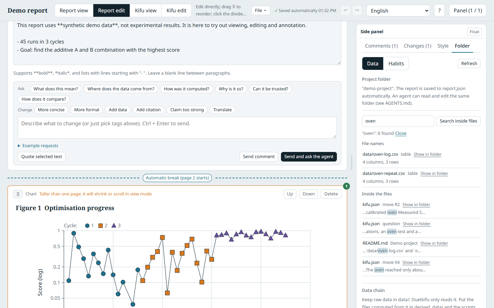

## 9. The report: review it with the agent

The report works as in [Duetsheet](https://github.com/Ashur5457/duetsheet): the agent writes, you review, one button asks the agent to revise, every change is kept.

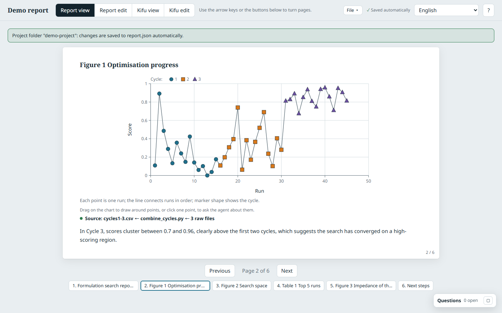

**Read** (**Report view**): the report is shown as pages; turn them with the arrow keys. There is no side panel here, so the page gets the whole width; to ask something, see [section 4](#4-ask-while-you-read).

**Review** (**Report edit**): change titles, text and captions directly; under **Quick adjustments and download**, change a chart's type, axes or scale. On a chart, hold the mouse button and draw around the points you mean, as in a paint program, or click one point; **Box on figure** draws a rectangle. The comment stores the data range and the ids of the points, which is what the agent reads. Under every block, write a comment with tags (*Ask* tags for questions, *Change* tags for edits) or an **Example request**. The **side panel** lists the comments: drag its header to float it where you like, drag its corner to resize, **–** folds it to a line, **Pin on the right** puts it back at the side.


**Ask the agent to revise**: if Claude Code started Duetkifu, it listens in the background at no cost. The button hands it your comments; the page shows its progress and reloads. It answers under each comment; answer back with **Reply**. Without a listening agent, the button gives you a prompt to paste.

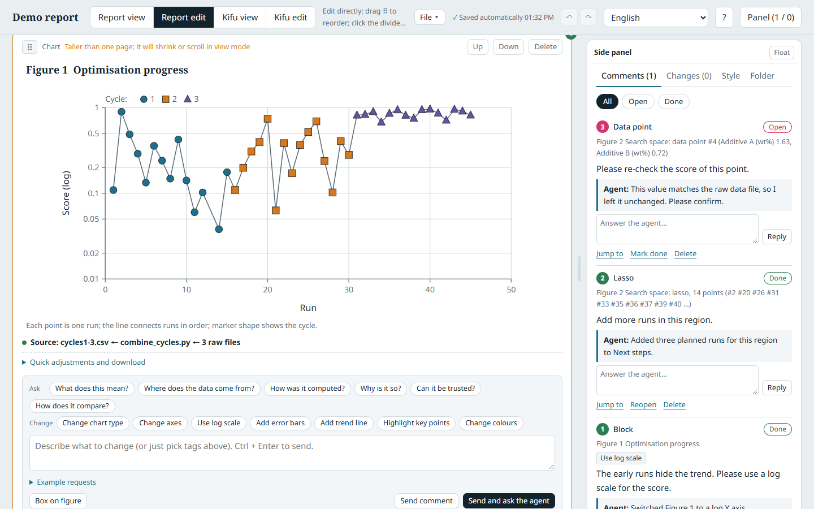

**Check what changed**: the **Changes** tab lists every change of the round, by you or the agent, as inline differences; **Show full history** shows every round, and each change can be reverted. The timeline has one row per block and one column per round.

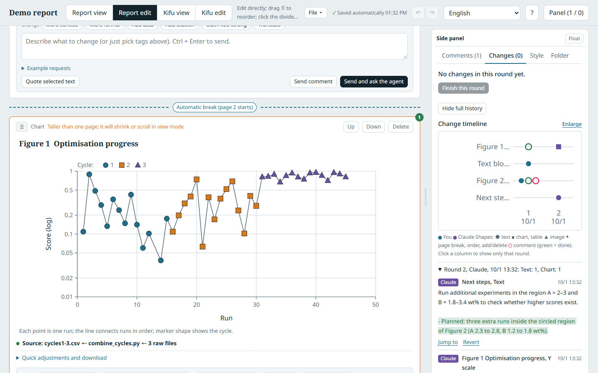

**Tie the report to the record**: a chapter of the report (a text block with a title) can name the move it tells. Those moves make the main path of the tree. The comment tag **Add to the report** on a move asks the agent to write such a chapter.

## 10. Saving, undo and backups

**Nothing to save.** Every change is written at once to `report.json` and `kifu.json` in the folder, and the top bar says so: *Saving…*, then *Saved automatically* with the time. If a write fails, the bar turns red and says why; if no folder is open, it says *Not saved to a folder*.

**Undo and Redo.** The arrows in the top bar (or Ctrl+Z and Ctrl+Y outside a text box, where the browser undoes your typing) take back **your own** changes, newest first: the report changes of the current round, and the changes to the record since the last round. Hover over an arrow to see what it will undo. The agent's changes are not undone this way; use **Revert** in the Changes tab. A change you take back in the Kifu is recorded too.

**The File menu.**

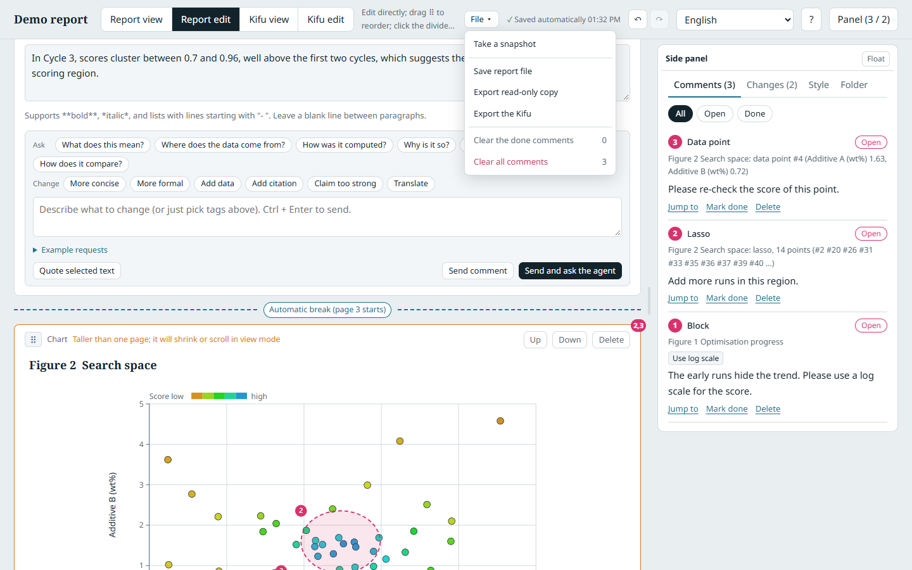

- **Take a snapshot** copies `report.json` and `kifu.json` into `exports/snapshots/<date-time>/`, to go back to later.
- **Save report file**, **Export read-only copy** (one HTML file for someone who does not use Duetkifu) and **Export the Kifu**.
- **Clear the done comments** and **Clear all comments** remove comments, with the agent's answers. Before it removes anything, the page tells you how many there are, how many are not done yet, and takes a snapshot, so a mistake can be undone.

## 11. Raw data, habits and languages

- **Raw data**: the **Folder** tab lists the data files; **Import** turns one into a dataset with its path and fingerprint. Every script your agent runs is recorded as a step, so each chart shows its data chain (*Source: cycles1-3.csv ← combine_cycles.py ← 3 raw files*), green when every file is as recorded and red when something changed. Put new files into the folder and the steps that should use them turn red.

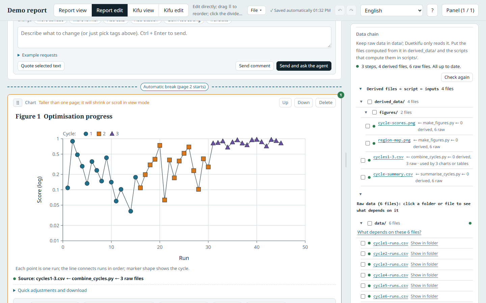

- **Habits**: put figures you like in `habits/figures/` and texts you wrote in `habits/writing/`; **Learn my habits** and your agent suggest a figure style and writing rules, which you tick to keep.

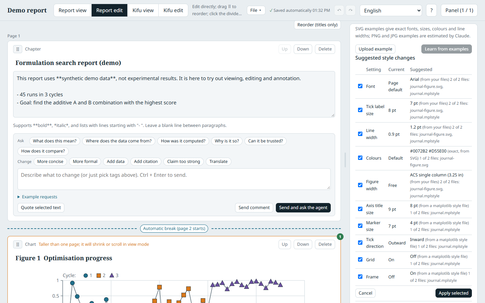

- **Languages**: the interface follows your browser (English, Traditional Chinese, Simplified Chinese, Japanese, Korean, Spanish); change it at the top right or add your own ([how](translating.md)). The data never changes with the language.

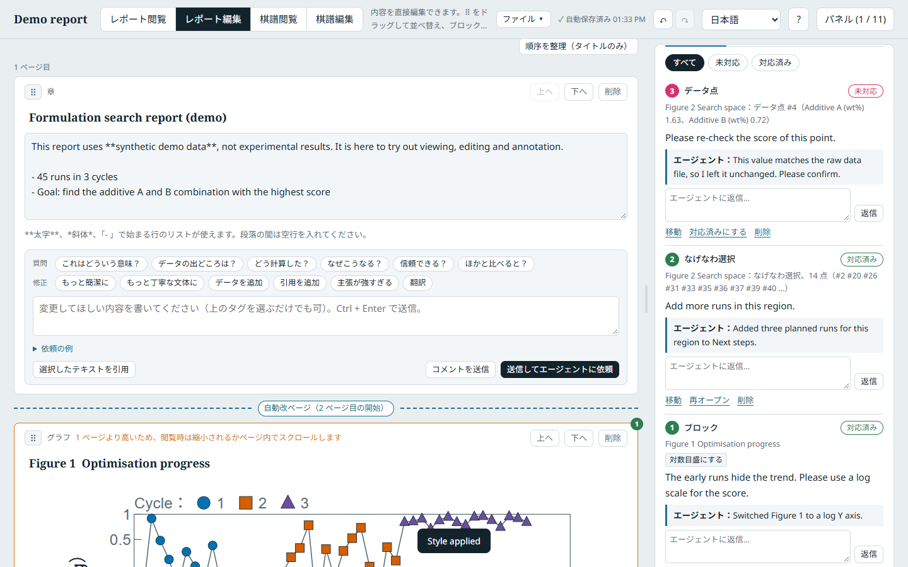

## When something goes wrong

- Errors and warnings stay listed under **⚠** at the top, with details and **Copy all**. With the launcher they are also printed for your agent and saved in `errors.log`.
- **The launcher was closed** while the page stayed open: the page says so once and stops saving. Start it again and reload the page.
- A file the agent is writing is never half-read: the page keeps the last good version until the file reads correctly.
- Saves that fail because another program holds the file for a moment (OneDrive, for example) are retried.
- **A block or panel is somewhere you cannot find it**: *Reset layout* (above the tree) puts the Kifu view back; the floating panels keep their place in your browser, so clear the site data of the page to reset them.
